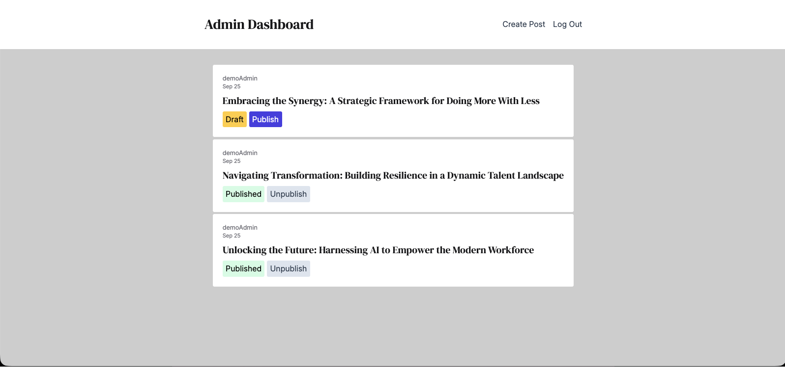
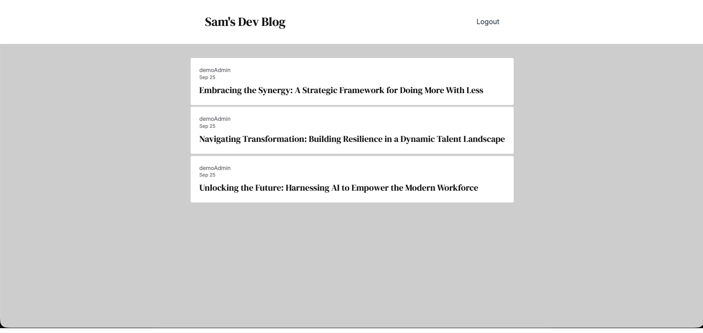
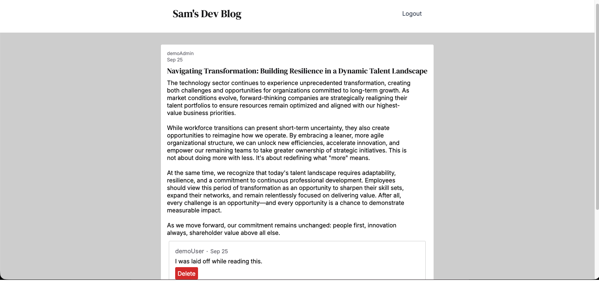

# 💻 Blog API

A full-stack application built with React, Node.js, PostgreSQL, Prisma, JWT, and CSS Modules.

This project was created to learn how to design an API that connects to two separate frontend applications and implement JWT authentication.

## 🚀 Live Deployment

API (open this first to allow the server to wake up): https://blog-api-fc47.onrender.com/

Admin Frontend: https://blog-api-lzoj.onrender.com/

Client Frontend: https://blog-api-o1l0.onrender.com/

## ▶️ Demo Accounts

Admin - Can access either Admin or Client

- email: demoadmin@example.com
- password: adminaccount

Client - Can only access Client

- email: demouser@example.com
- password: useraccount

## 📋 Overview

The public-facing client application allows users to browse published blog posts, comment on posts, and delete their own comments.

The admin portal is reserved for blog authors. Authors can only access and manage their own posts, but can edit or delete any comment on those posts.

Publishing a post determines whether it is visible on the public-facing client.

## 👨‍💻 Technologies Used

- React
- React Router
- CSS Modules
- Node.js
- Express
- Prisma
- PostgreSQL
- Passport
- JWT
- Express Validator

## ✨ Features

### Client

- User registration
- View published blog posts
- Comment on blog posts
- Delete own comments

### Admin

- Restricted to blog authors
- View and manage their own blog posts
- Create new posts
- Publish/unpublish posts
- Edit and delete comments on their posts

## 👨‍🎓 What I Learned

- How to design a RESTful API
- How to implement JWT authentication and authorization
- How to connect multiple frontend applications to a single API
- How to use Prisma with PostgreSQL
- How to structure a full-stack application as a monorepo
- How to manage authentication state across React applications

## 🛠️ Future Improvements

- Allow blog authors to delete their posts
- Add TinyMCE rich text editor to create blog posts
- Allow users to upgrade their account to a blog author account

## 📺 Screenshots

### Admin Dashboard

### Client Dashboard

### Post and Comments

